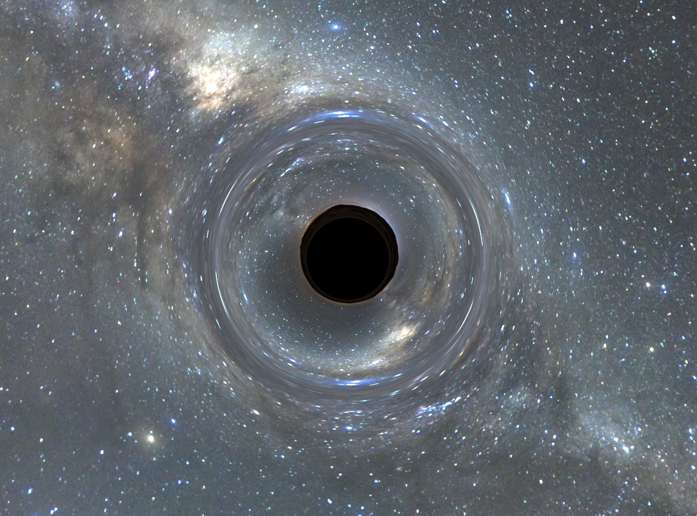

CUDA Path Tracer
================

**University of Pennsylvania, CIS 565: GPU Programming and Architecture, Project 3**

* Lewis Ghrist
* [Personal Website](https://siwel-cg.github.io/siwel.cg_websiteV1/index.html#home), [LinkedIn](https://www.linkedin.com/in/lewis-ghrist-4b1b3728b/)
* Tested on: Windows 11, AMD Ryzen 9 5950X 16-Core Processor, 64GB, NVIDIA GeForce RTX 3080 10GB

# Renders (MORE TO COME)

  
  

  
  

  
  

  

# Overview

First, a quick introduction to **Path tracing**. Path tracing is a physically-based rendering technique that simulates light transport by tracing rays backward from the camera into the scene. Each ray bounces off surfaces, accumulating color and lighting information until it either hits a light source or is terminated. By averaging many randomly sampled paths per pixel, the algorithm converges to a photorealistic image with accurate global illumination, soft shadows, and complex light interactions.

### GPU Implementation

This path tracer uses a **wavefront architecture** optimized for GPU parallelism. Instead of assigning each thread a complete path (which would cause divergence as paths terminate at different times), each thread processes a single path segment-one bounce at a time. This allows for other optimizations such as stream compaction and material sorting, which I will explain later on. The general process of path tracing is:

1. Rays are cast from the camera with initial energy (throughput) of 1.0
2. All active rays are evaluated in parallel for their current bounce
3. Upon intersection, the ray's throughput is multiplied by the surface's BSDF response
4. Surviving rays continue to the next bounce iteration

This approach maintains high GPU occupancy by keeping threads synchronized at each bounce level, avoiding the warp divergence that would occur if different threads were at different depths in their paths.
For a deeper dive into path tracing, see [PBRT](https://www.pbr-book.org/3ed-2018/Light_Transport_I_Surface_Reflection/Path_Tracing) or [Ray Tracing in One Weekend](https://raytracing.github.io/).
---
In this project, various visual and performace improving features were implemented including:
### Core Rendering
- **Physically-Based Materials**: Diffuse and mirror BSDFs with stochastic roughness-based blending
- **Stochastic Anti-Aliasing**: Randomized subpixel sampling for smooth edges
- **Environment Mapping**: HDR skybox lighting with spherical coordinate sampling

### Advanced Effects
- **Black Hole Gravitational Lensing**: Physically accurate light bending with procedural accretion disk (see below)
- **Depth of Field**: Thin lens camera model with configurable focal distance and aperture size
- **Bloom Post-Processing**: Perceptual luminance-based glow for bright light sources

### Performance Optimizations
- **BVH Acceleration**: Custom bounding volume hierarchy for fast ray-mesh intersection
- **Stream Compaction**: Automatic culling of terminated ray paths to maintain GPU efficiency
- **Material Sorting**: Coherent BSDF evaluation through dynamic ray reordering

### Pipeline
- **Custom OBJ Loader**: Direct obj mesh import supporting positions and normals

# Featurs
## Black Hole Gravitational Lensing

Path tracing typically assumes light travels in perfectly straight lines-and for the most part, that's accurate. Even phenomena like refraction that *seem* to warp light are really just straight-line segments through different media. Black holes, however, are a dramatic exception. Their immense mass distorts spacetime itself, bending the paths of light rays in ways that can't be modeled with simple geometry.

This seemed like the perfect challenge for a path tracer.

### The Approach

The concept is straightforward: when a ray intersects the black hole's influence sphere, instead of tracing straight ahead, we simulate the ray's trajectory as it curves under gravitational acceleration toward the center-much like simulating a particle under Newtonian gravity (because fundamentally, that's what's happening to the photon).

During each integration step:
- If the ray passes within a minimum radius (the event horizon), it's absorbed-we zero out the path's energy, leaving the pixel black
- If it exceeds a maximum radius, it's escaped the gravitational field-we resume standard straight-line ray marching until the next scene intersection

Simple, right?

### The Physics

The challenge: *how strong is the gravitational pull?* I'm not a physicist, and general relativity is... complicated. Fortunately, much smarter people have done the heavy lifting. The implementation is based on [this excellent article](https://rantonels.github.io/starless/) by rantonels, which derives a surprisingly elegant formula for the acceleration experienced by light near a Schwarzschild (non-rotating, uncharged) black hole.

With this acceleration equation in hand, I implemented an RK4 integrator for numerical stability and efficiency. The result: light rays that genuinely curve through spacetime around our black hole sphere.

  

### Accretion Disk
As you can see from the renders above, there is a bit more to a black hole than just light bending. Real black holes (at least the ones we can see) have this disk of glowing gass and debris spiraling around and into it. This glowing disk is what makes the gravitational lensing visible: light from the back of the disk bends over and around the black hole, creating the iconic "halo" effect. Simulating actual clouds of volumes would be another level of complexity I neither had the time nor the need to do. Instead, we can get a somewhat convincing result by faking this disk with a noise. If our stepped ray passes through the accretion disk plane, we can use that position to sample a noise and shade the ray accordingly.

  

### Implementation

 After each step our ray inside the gravitation field takes, I check if it passes our accretion disk's plane. If so, I find where between the current position and the last position it crosses this plane. Using that 2D coordinate, I sample a simple perlin noise function and then swirl the result based on the radius from the center very similarly to the technique I used in this past black hole project: [black hole shader work](https://siwel-cg.github.io/siwel.cg_websiteV1/projects/BlackHole.html). This gives the spiralling look without having to incorperate any actual motion into the black hole math. 

# References
- https://henrikdahlberg.github.io/2016/08/23/stream-compaction.html
- https://nvidia.github.io/cccl/thrust/api/group__stream__compaction_1gaf01d45b30fecba794afae065d625f94f.html
- https://jacco.ompf2.com/2022/04/13/how-to-build-a-bvh-part-1-basics/
- http://spiro.fisica.unipd.it/~antonell/schwarzschild/
- https://rantonels.github.io/starless/
- https://web.mit.edu/10.001/Web/Course_Notes/Differential_Equations_Notes/node5.html
- https://blog.seanholloway.com/2022/03/13/visualizing-black-holes-with-general-relativistic-ray-tracing/
- https://learnopengl.com/Advanced-Lighting/Bloom
- https://github.com/tinyobjloader/tinyobjloader/tree/release
- https://free3d.com/3d-model/hand-v3--902450.html
- https://www.spacespheremaps.com/hdr-spheremaps/