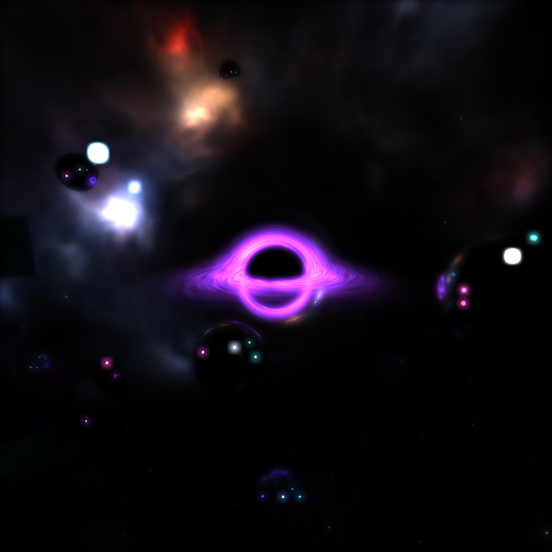
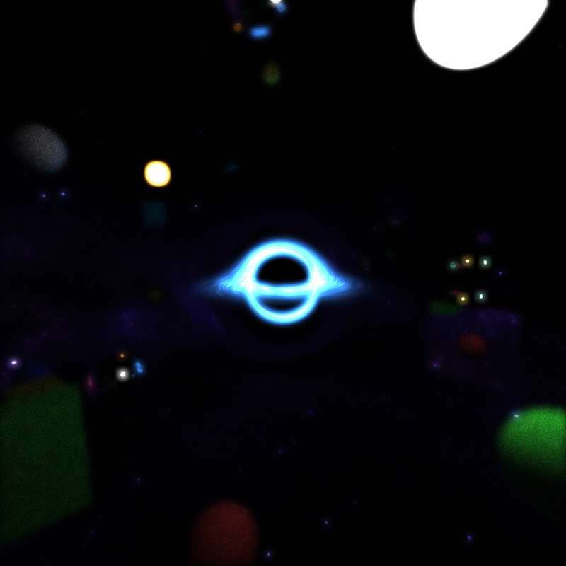
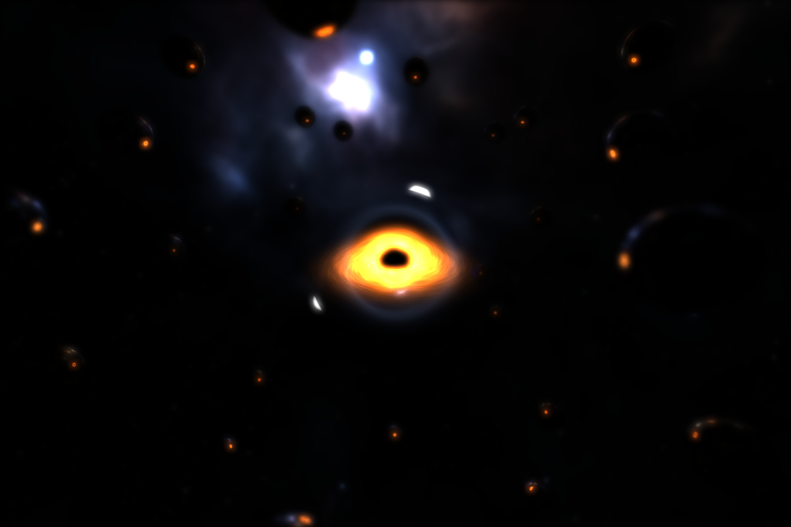
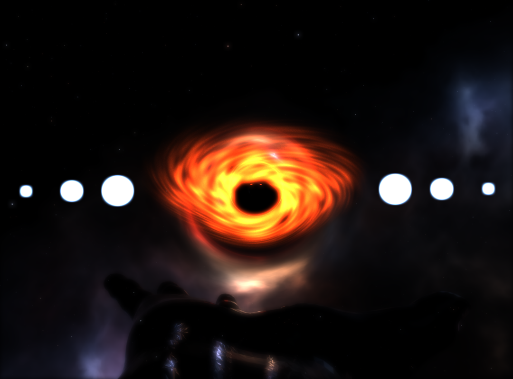
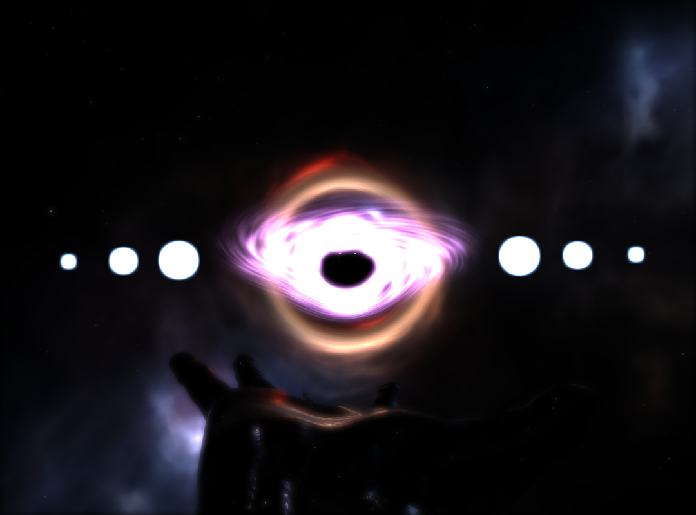
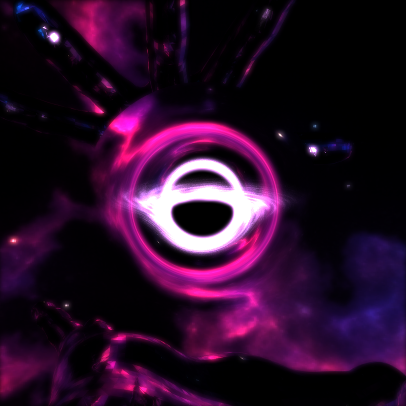
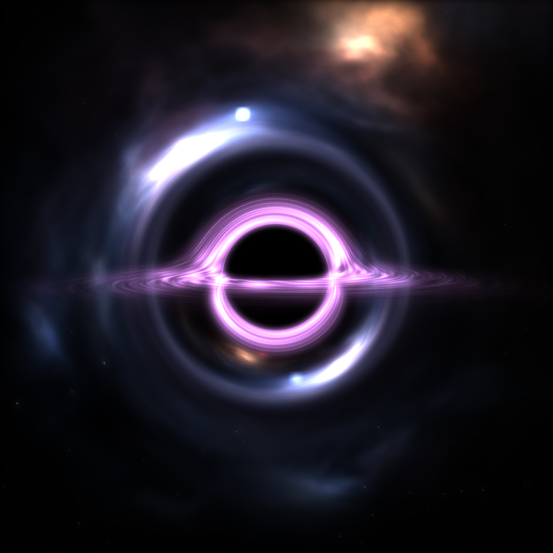

CUDA Path Tracer
================

**University of Pennsylvania, CIS 565: GPU Programming and Architecture, Project 3**

* Lewis Ghrist
* [Personal Website](https://siwel-cg.github.io/siwel.cg_websiteV1/index.html#home), [LinkedIn](https://www.linkedin.com/in/lewis-ghrist-4b1b3728b/)
* Tested on: Windows 11, AMD Ryzen 9 5950X 16-Core Processor, 64GB, NVIDIA GeForce RTX 3080 10GB

### Renders (MORE TO COME)

  
  

  
  

  
  

  

### Implemented Features
# Core Features:
- Diffuse and Mirror BSDF shading with stochatic blending based on roughness
- Stream compaction for culling finished paths
- Material sorting 
- Stochastic AA sampling
# Custom Features:
- Cutom OBJ mesh loading
- BVH spatial data structure
- Thin lense depth of field
- Environment mapping
- Physically acuarate light bending black hole with noise based acretion disk
- Bloom post processing

### References
- https://henrikdahlberg.github.io/2016/08/23/stream-compaction.html
- https://nvidia.github.io/cccl/thrust/api/group__stream__compaction_1gaf01d45b30fecba794afae065d625f94f.html
- https://jacco.ompf2.com/2022/04/13/how-to-build-a-bvh-part-1-basics/
- http://spiro.fisica.unipd.it/~antonell/schwarzschild/
- https://rantonels.github.io/starless/
- https://web.mit.edu/10.001/Web/Course_Notes/Differential_Equations_Notes/node5.html
- https://blog.seanholloway.com/2022/03/13/visualizing-black-holes-with-general-relativistic-ray-tracing/
- https://learnopengl.com/Advanced-Lighting/Bloom
- https://github.com/tinyobjloader/tinyobjloader/tree/release