CUDA Path Tracer
================

**University of Pennsylvania, CIS 565: GPU Programming and Architecture, Project 3**

* Lewis Ghrist
* [Personal Website](https://siwel-cg.github.io/siwel.cg_websiteV1/index.html#home), [LinkedIn](https://www.linkedin.com/in/lewis-ghrist-4b1b3728b/)
* Tested on: Windows 11, AMD Ryzen 9 5950X 16-Core Processor, 64GB, NVIDIA GeForce RTX 3080 10GB

# Renders (MORE TO COME)

  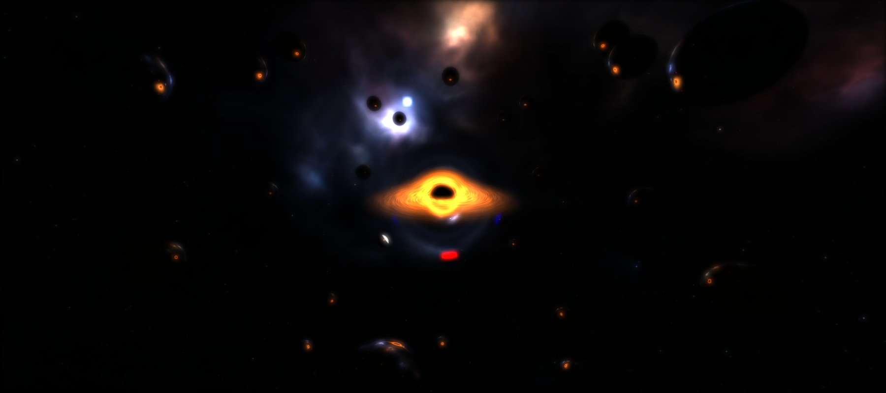

  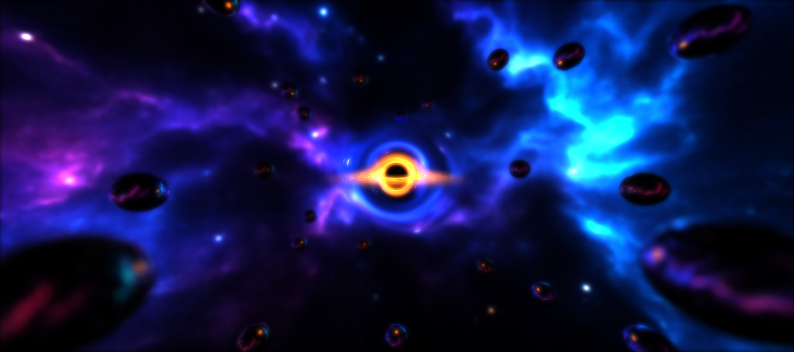

  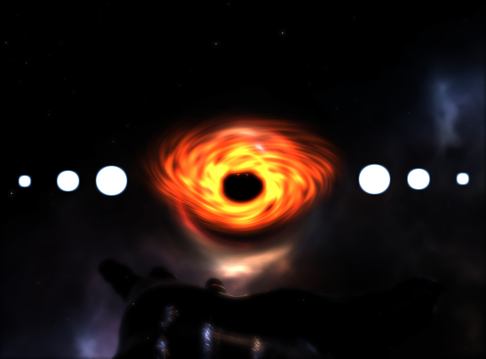

  

# Overview

First, a quick introduction to **Path tracing**. Path tracing is a physically-based rendering technique that simulates light transport by tracing rays backward from the camera into the scene. Each ray bounces off surfaces, accumulating color and lighting information until it either hits a light source or is terminated. By averaging many randomly sampled paths per pixel, the algorithm converges to a photorealistic image with accurate global illumination, soft shadows, and complex light interactions.

### GPU Implementation

This path tracer uses a **wavefront architecture** optimized for GPU parallelism. Instead of assigning each thread a complete path (which would cause divergence as paths terminate at different times), each thread processes a single path segment-one bounce at a time. This allows for other optimizations such as stream compaction and material sorting, which I will explain later on. The general process of path tracing is:

1. Rays are cast from the camera with initial energy (throughput) of 1.0
2. All active rays are evaluated in parallel for their current bounce
3. Upon intersection, the ray's throughput is multiplied by the surface's BSDF response
4. Surviving rays continue to the next bounce iteration

This approach maintains high GPU occupancy by keeping threads synchronized at each bounce level, avoiding the warp divergence that would occur if different threads were at different depths in their paths.
For a deeper dive into path tracing, see [PBRT](https://www.pbr-book.org/3ed-2018/Light_Transport_I_Surface_Reflection/Path_Tracing) or [Ray Tracing in One Weekend](https://raytracing.github.io/).

---

In this project, various visual and performace improving features were implemented including:
### Core Rendering
- **Physically-Based Materials**: Diffuse and mirror BSDFs with stochastic roughness-based blending
- **Stochastic Anti-Aliasing**: Randomized subpixel sampling for smooth edges
- **Environment Mapping**: HDR skybox lighting with spherical coordinate sampling

### Advanced Effects
- **Black Hole Gravitational Lensing**: Physically accurate light bending with procedural accretion disk (see below)
- **Depth of Field**: Thin lens camera model with configurable focal distance and aperture size
- **Bloom Post-Processing**: Perceptual luminance-based glow for bright light sources

### Performance Optimizations
- **BVH Acceleration**: Custom bounding volume hierarchy for fast ray-mesh intersection
- **Stream Compaction**: Automatic culling of terminated ray paths to maintain GPU efficiency
- **Material Sorting**: Coherent BSDF evaluation through dynamic ray reordering

### Pipeline
- **Custom OBJ Loader**: Direct obj mesh import supporting positions and normals

# Featurs
## Black Hole Gravitational Lensing

Path tracing typically assumes light travels in perfectly straight lines-and for the most part, that's accurate. Even phenomena like refraction that *seem* to warp light are really just straight-line segments through different media. Black holes, however, are a dramatic exception. Their immense mass distorts spacetime itself, bending the paths of light rays in ways that can't be modeled with simple geometry.

This seemed like the perfect challenge for a path tracer.

### The Approach

The concept is straightforward: when a ray intersects the black hole's influence sphere, instead of tracing straight ahead, we simulate the ray's trajectory as it curves under gravitational acceleration toward the center-much like simulating a particle under Newtonian gravity (because fundamentally, that's what's happening to the photon).

During each integration step:
- If the ray passes within a minimum radius (the event horizon), it's absorbed-we zero out the path's energy, leaving the pixel black
- If it exceeds a maximum radius, it's escaped the gravitational field-we resume standard straight-line ray marching until the next scene intersection

Simple, right?

### The Physics

The challenge: *how strong is the gravitational pull?* I'm not a physicist, and general relativity is... complicated. Fortunately, much smarter people have done the heavy lifting. The implementation is based on [this excellent article](https://rantonels.github.io/starless/) by rantonels, which derives a surprisingly elegant formula for the acceleration experienced by light near a Schwarzschild (non-rotating, uncharged) black hole.

With this acceleration equation in hand, I implemented an RK4 integrator for numerical stability and efficiency. The result: light rays that genuinely curve through spacetime around our black hole sphere.

  <a href="IMAGES/LightWarpSolo_V1.png">
    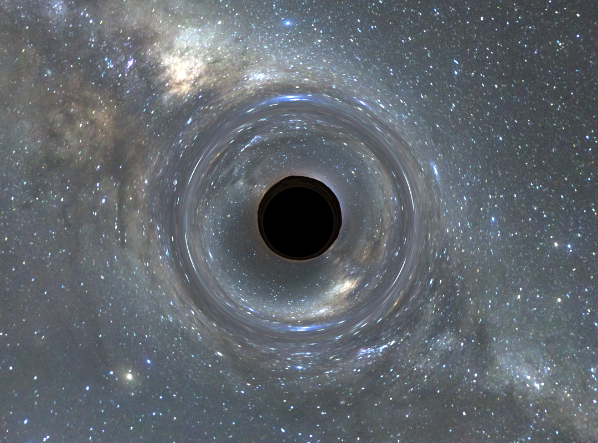
  </a>

### Accretion Disk
As you can see from the renders above, there is a bit more to a black hole than just light bending. Real black holes (at least the ones we can see) have this disk of glowing gass and debris spiraling around and into it. This glowing disk is what makes the gravitational lensing visible: light from the back of the disk bends over and around the black hole, creating the iconic "halo" effect. Simulating actual clouds of volumes would be another level of complexity I neither had the time nor the need to do. Instead, we can get a somewhat convincing result by faking this disk with a noise. If our stepped ray passes through the accretion disk plane, we can use that position to sample a noise and shade the ray accordingly.

  <a href="IMAGES/BlackHoleSolo_V1.png">
    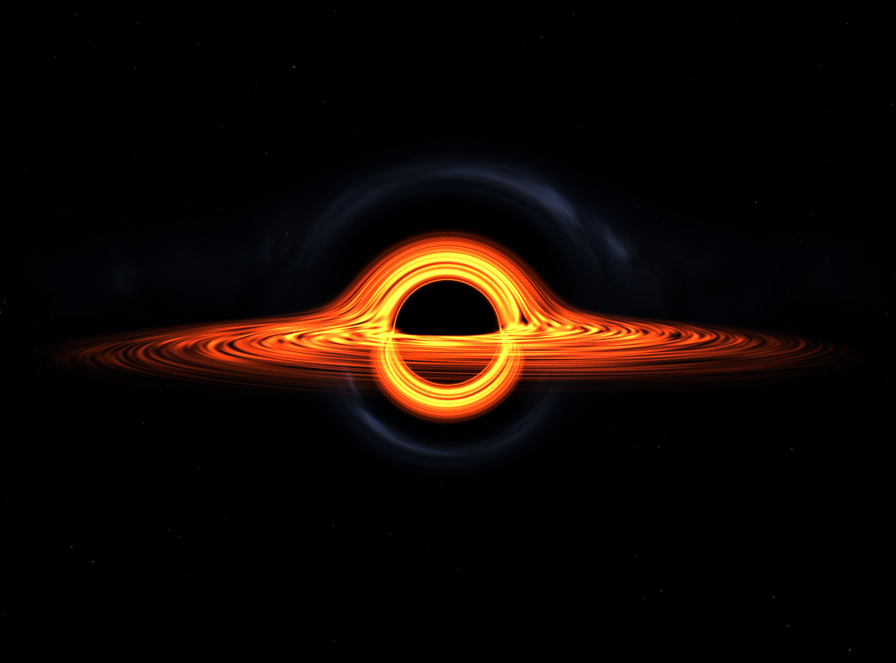
  </a>

### Implementation
So how does this all fit into our path tracer setup? As mentioned, I reuse the sphere intersection setup I had and treat the black hole as a material with a few key parameters: an RGB color channel, emittance, inner radius (event horizon), and outer radius (influence boundary). When a ray hits an object with this material, instead of performing standard BSDF evaluation, we hand it off to a specialized `blackHoleRay()` function that handles the curved spacetime integration.

Starting from the intersection point, we initialize the ray's position relative to the black hole center and march it forward using RK4 integration. At each step, we update both position and velocity based on the gravitational acceleration formula from the Schwarzschild metric:

$$\mathbf{a} = \frac{-3Mh^2}{|\mathbf{r}|^5} \mathbf{r} \cdot w$$

Where $M$ is the black hole mass, $h^2$ is the squared angular momentum (impact parameter), and $w$ is a windowing function that smoothly attenuates the force near the boundaries. The time step adapts based on the local curvature-smaller steps near the event horizon, larger steps farther out.

**Termination Conditions:**

During integration, we check for three outcomes:

1. **Event Horizon Capture**: Rays that get too close to the center zero out throughput and terminate.
2. **Accretion Disk Intersection**: Rays that cross the equatorial plane within disk bounds sample the noise function for emission (see below).
3. **Escape**: Rays that exit the outer radius moving outward return to normal path tracing.

**Accretion Disk Sampling:**

After each step our ray inside the gravitation field takes, I check if it passes our accretion disk's plane. If so, I find where between the current position and the last position it crosses this plane. Using that 2D coordinate, I sample a simple perlin noise function and then swirl the result based on the radius from the center very similarly to the technique I used in this past black hole project: [black hole shader work](https://siwel-cg.github.io/siwel.cg_websiteV1/projects/BlackHole.html). This gives the spiralling look without having to incorperate any actual motion into the black hole math. This noise is combined with a fall off of the radius to get a final value which I use to stochastically determine if a ray should stop and apply the emmited color to the path or continue going, passing through the accretion disk. This stochastic approach means some rays pass through the disk while others are absorbed, naturally creating the wispy, turbulent appearance of the accretion material. Although slightly ineficient, since to get a smooth, converged opacity you need to trace many rays, with this wavefront setup, this was the only way I could think of to do any sort of partial alpha effect. 

The best part about doing an accretion disk procedurally is that it is really easy to control the final visual output of the black hole. By varying some paramters in the noise functions, I can get different swirl intensities and densities of the disk. The nice thing about this approach is its modularity. From the path tracer's perspective, hitting a black hole is just another material evaluation, it updates the ray state and returns. Rays that escape continue bouncing through the scene normally, allowing the black hole to seamlessly composite with standard geometry and materials.

**A Quick Note On Efficency**

I will have more details and FPS analysis later on, but it should be intuitive that marching along a path is significantly slower than a simple mirror or diffuse bouce computation. This means that the treads for paths going through the black hole take longer than the threads who don't. At each wavefront iteration we need to sync up all the threads which means those quicker threads will have to wait. One optimization that helps with this is sorting by material type and making them contiguous in meory (this is part of the reason why I implemented this black holes as a material). I didn't really implement any other GPU specific optimizations for this, but one could be doing stream compaction for substep of our walk, similar to what we do for the actuall path segments. Even though, particularly for open scenes, the light distortion basically was real time, in close scenes where many paths bounce in and out of the black hole multiple times, it can have a significant performance impact. Most of my scenes and testing involved just 1 or 2 black holes, but if you have a scene with many, the same problem could occure. Using RK4 and updating time steps certainly does help with efficency, but future work could be done to take advantage of the parallel architecture even more for better results. 

# Visual Improvements
Besides this flashy black hole shader, I implemented a few other featurs which help to enhanse the effect of the black hole or overall just allows for more interesting visuals. The first being Bloom.

### Bloom
Bloom is a post process effect which adds an artificial glow to parts of the image which pass a certain birightness threshold. We naturally get this effect due to light bouncing around in our eye, but in a simulated world without an actual participating media for the light rays to travel to, this effect doesn't happen. But we can fake it in post. After the full image calculation has be run and we average the light values for all the rays of an iteration, we then do pass on each pixel and determine if it passes this light threshold, keeping only the ones that pass. From there, to get the glow effect, we blur this light filter using a Gaussian blur. In my implementation I used a 21x21 kernel, but the strength of the blur can be adjusted as needed. This blurred pass is then added back to our original image, giving it an angelic glowing effect. Particularly for the black hole, this makes quite the difference:

  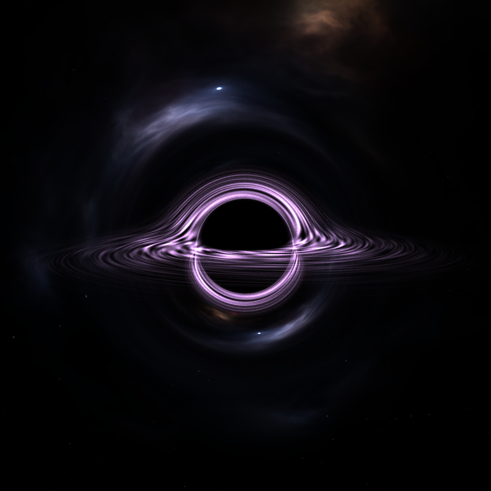
  

### Environment Mapping

To light scenes with realistic outdoor lighting, as well as test my black hole distortin, I implemented HDR environment map support. An environment map is essentially an image wrapped around the scene at infinite distance, providing both illumination and background imagery. When a ray fails to intersect any geometry in the scene, rather than returning black, we sample the environment map based on the ray's direction. The ray direction (a 3D vector) is converted to spherical coordinates theta (azimuthal angle) and phi (polar angle) which map to UV coordinates on the environment texture:

$$u = \frac{1}{2} + \frac{\arctan2(d_z, d_x)}{2\pi}, \quad v = \frac{1}{2} - \frac{\arcsin(d_y)}{\pi}$$

Where $\mathbf{d}$ is the normalized ray direction. This spherical mapping allows a 2D image to represent all possible incoming light directions.

The environment map integrates naturally into the path tracing pipeline: it's simply another potential light source. Rays accumulate color from environment lighting just like they would from any emissive surface, and the map's contribution is weighted by the path's current throughput.

  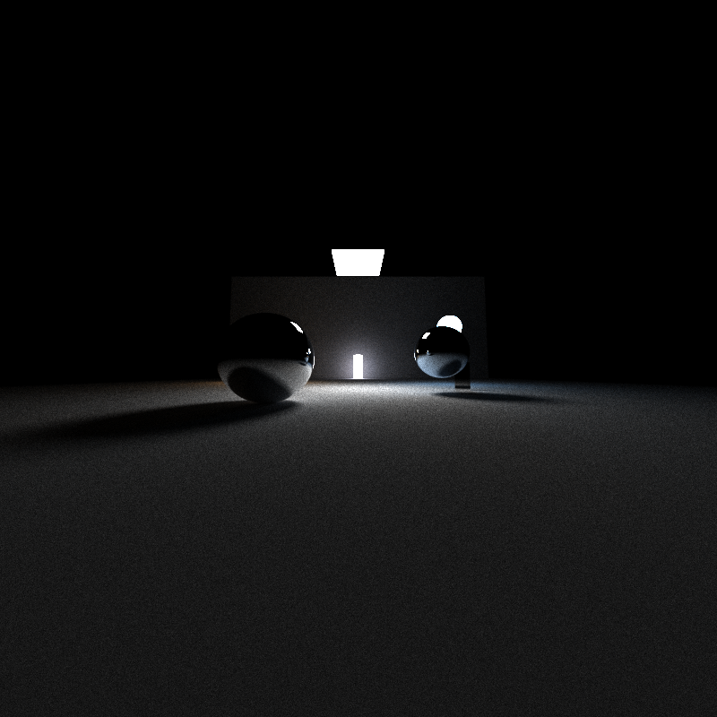
  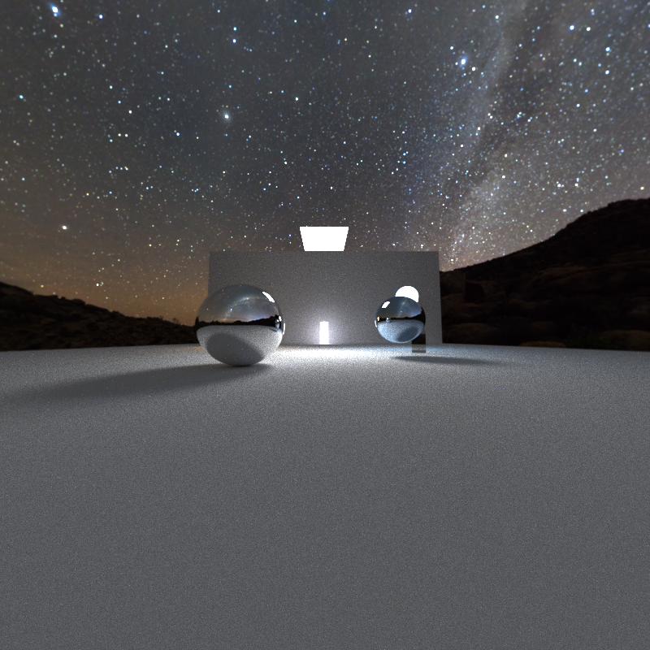

### Thin Lense Depth Of Field

Real cameras have finite apertures, creating a depth of field effect where objects at the focal distance appear sharp while objects closer or farther away become progressively blurred. I implemented this using a thin lens camera model. Unlike a pinhole camera where every ray passes through a single point (keeping everything in perfect focus), a thin lens has an aperture with non-zero radius. Rays originating from different points on the lens converge at the focal plane but diverge elsewhere, creating blur.

  <a href="IMAGES/Thin_Lens.png">
    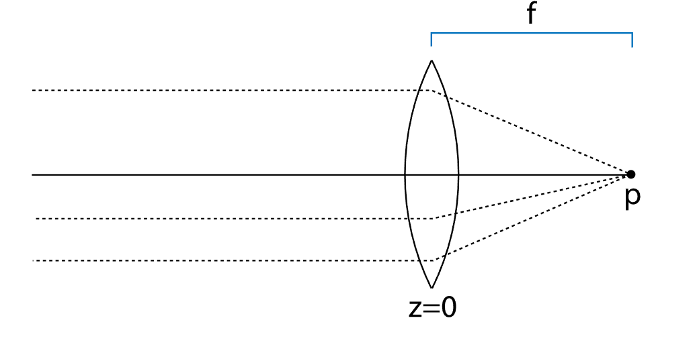
  </a>

The implementation samples random points on the circular lens aperture using concentric disk sampling, then adjusts each ray's direction so it passes through the same point on the focal plane that the original ray (from the lens center) would have hit. Over many frames, rays from different lens positions average together points at the focal distance receive consistent samples and appear sharp, while points at other depths receive divergent samples, creating blur proportional to their distance from the focal plane. The effect is controlled by two parameters: lens radius (aperture size, where larger means stronger blur) and focal distance (which depth appears sharp).

  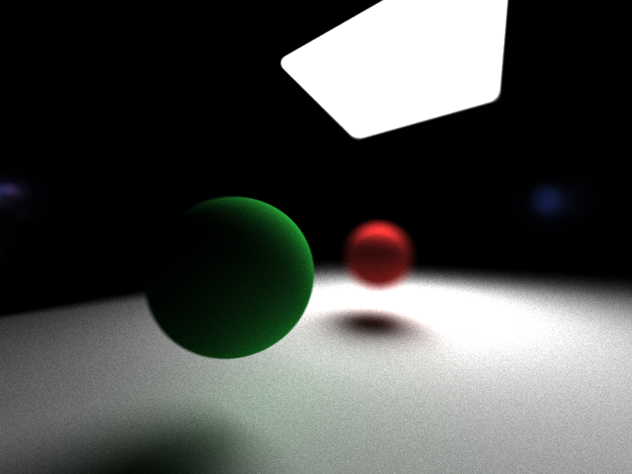
  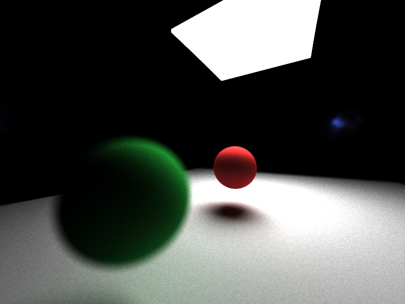

### Stochastic Anti-Aliasing

Similarly to how we scattered ray origins across the lens aperture to achieve depth of field, we can apply the same stochastic sampling principle to eliminate aliasing. Instead of casting rays through the exact center of each pixel, we jitter the ray origin randomly within the pixel's area. Without this, rendered images suffer from jagged edges where object boundaries don't align perfectly with pixel centers causing a "staircase" like artifact. Each frame uses a different random offset within the pixel, so over many iterations the samples average across the entire pixel area. Edges that partially cover a pixel receive proportionally mixed colors, naturally producing the correct blended color. This approach requires no special edge detection or additional samples per frame, unlike what you would need for a rasterize. The anti-aliasing emerges automatically from the same Monte Carlo integration that drives the path tracing itself.

# Performance Improvements

Path tracing is computationally expensive, and even with the parallel power of a GPU, without good thread utilization, performence can still be slow. Several optimizations were crucial to achieving interactive frame rates. The first and most important one was a Bounding Volume Heiarchy (BVH) which allowed for OBJ mesh loading.

### BVH and OBJs
The goal of BVH is to reducce the number of intersection tests you need to do for a ray. In a niave path tracer implementation, for each ray, you check every single object in your scene to see if the ray hits that object. For anything more complicated than a few simple pieces of geometry, this takes forever. In order to do any type of custom mesh loading, BVH or some other type of acceleration structure was crucial. 

A BVH solves the intersection scaling problem by organizing geometry into a tree of nested bounding boxes. The key insight is that if a ray doesn't hit a bounding box, it can't possibly hit any of the geometry inside that box, allowing us to skip entire branches of the tree and taking our intersection test time from $O(N)$ to $O(log(N))$. First, the hierarchy is built recursively on the CPU. For agiven node, we compute the overall bounding box of that node, the partition each internal piece of geometry based on its centroid and the midpoint of the longest axis of our bounding box. This creates two sets of geometry, one on the "left" of the midpoint and one on the "right". These then go on to become their own nodes and so on until we reach a minimum size limit and we get a leaf node.

Before we build this BVH tree, we first need to load in our OBJ triangle meshes into our geometry array. For simplicity, I used the [tinyobjloader](https://github.com/tinyobjloader/tinyobjloader/tree/release) library which automatically handles reading in an OBJ and converting it into triangle positions and normals with the correct indices. With these triangles I precompute the centroid positions, and finally store the actual geometry into the goemetry array. After which, we build our BVH tree.

This tree is then sent to the GPU via a linearized tree structure rather than pointer-based nodes. Nodes are stored in a flat array with children accessed via index offsets and geometry stored as start and end indices in our Geometry array. This provides better cache coherence on the GPU, where pointer chasing is expensive. During rendering, ray-BVH intersection uses a stack-based traversal. Starting at the root, we test the ray against the node's AABB. If it misses, we pop back up the tree. If it hits and the node is internal, we push both children onto the stack. If it hits a leaf node, we test against all triangles in that leaf. The closest intersection found across all tested triangles is returned. This allows rays to skip vast portions of the scene transforming render times for complext models from minutes per frame to interactive rates.

  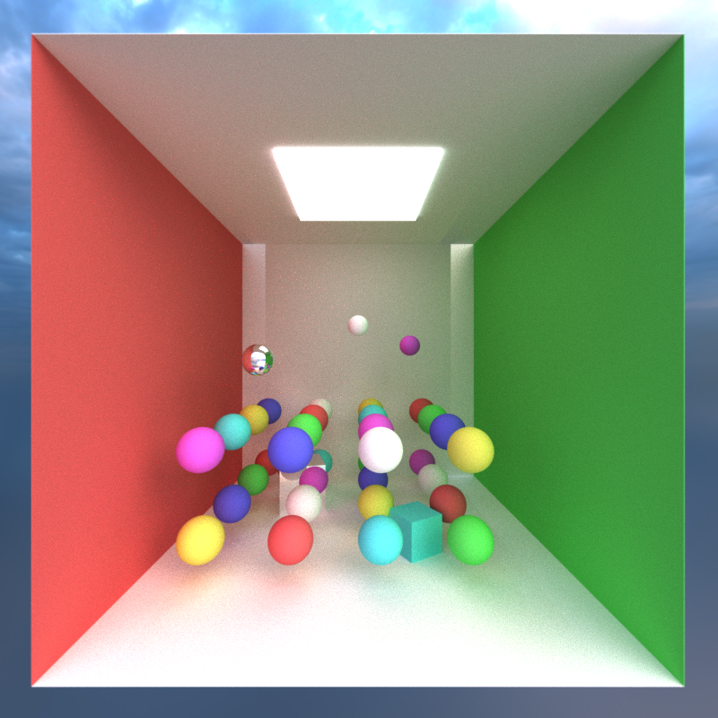
  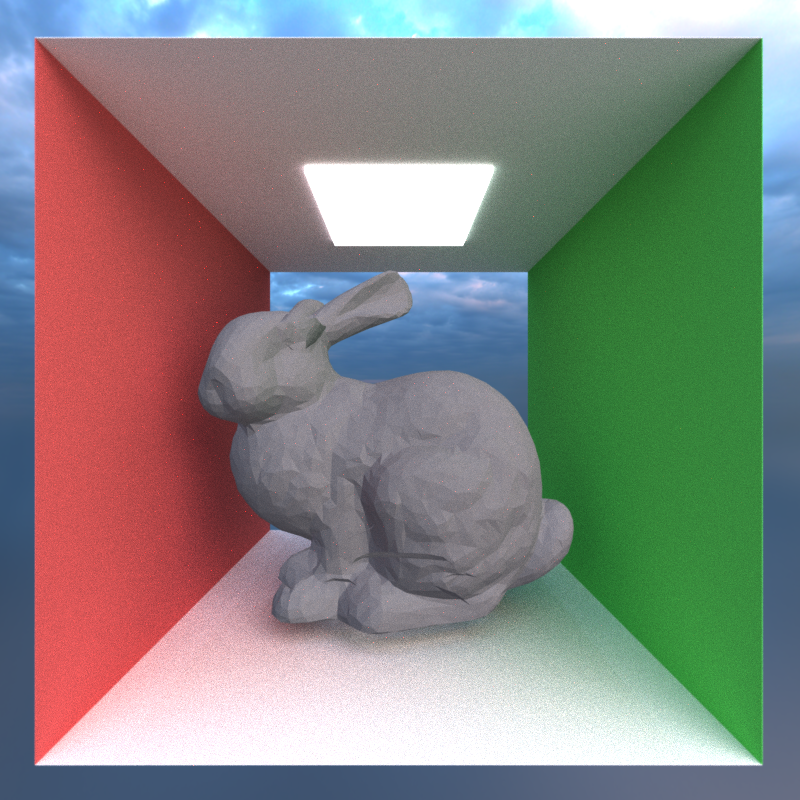

### Stream Compaction
As I have mentioned a few times now, one area for optimization is in culling "dead" rays so that we don't use threads to calculate nothing. For this, we can use stream compaction. Stream compaction is a parallel way of doing a linear search through an array and removing unwanted elements while shifting all the other elements downwards so they are continuous in the array. We can take advantage of this algorithm to efficiently remove these useless path segments each bounce. For this, I use `thrust::partition` to separate paths into two groups: those still alive (`remainingBounces > 0`) and those that have finished. The partition operation is stable and efficient, rearranging the path array in-place so all active paths are packed at the front. We then update the path count to reflect only the active paths, and subsequent bounces operate on this smaller buffer. For a closed scene with only a few lights, this will have a minimum effect. However, the real advantage comes when you have a very open scene. Since many of the rays will go of into empty space and terminate just after the first bounce, at each iteration, many of our rays will beocme usless. By dynamically culling them, we can drastically reduce the amount of wasted kernel calls resulting in much faster renders. 

### Material Sorting
The last bit of optimization we can do, is sorting the path segments based on the materials they hit. What we want is for each warp to execute the same instructions coherently. When paths hit different material types and evaluate different BSDFs, they diverge and some threads execute, for example, diffuse shading code while others execute specular reflections, This warp divergence forces the GPU to serialize execution, dramatically reducing throughput. Particularly, as I mentioned, for my black hole ray stepping material. Material sorting addresses this by reordering paths before shading so that rays hitting the same material type are grouped together. I use `thrust::sort_by_key` with the material ID as the key and the path segment as the value. After sorting, all paths evaluating diffuse materials execute consecutively, followed by all specular paths, then black hole paths, and so on. Threads within each warp now execute the same BSDF code path, eliminating divergence and improving memory access coherence since similar materials often have similar memory layouts.

# Performance Analysis
### Stream Compaction
As mentioned, stream compaction can significantly impact render performance particularly on very open scenes. As such, I compared the average frame rate over on both open and closed scenes with minimal objects in them and with a bounce limit of 24. The data shows this improvement with the stream compaction having a marginal increase in FPS for the close scene, and a much larger increase for the open scene. 

  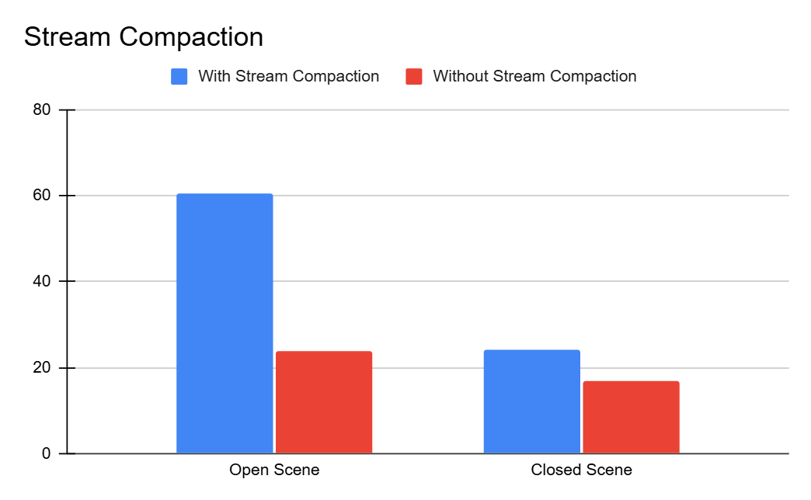

### BVH 
BVH is what made object loading possible. Even though for small scenes, the overhead of constructing the tree is not worth it, as I found for my implementation, for anything over about 200 objects, is not even viable. For the larger models, the render would instantly crash on the first iteration of bounces. Again, across various scenes with differing numbers of objects, I took the average FPS over a 30 second window. The scenes were partially open, so stream compaction had some effect, however the majority of the "heavy lifting" was done by the BVH.

  

### Black Holes
Since a black hole thread takes much longer than a regular thread, I also tested scenes with multiple black holes. For simplicity, I had just black holes in a completely open scene so that random bounces from diffuse surfaces wouldn't alter any results. Although, as expected, the results get worse the more black holes there are, I was plesently supprised. Even with 128 black holes I was still getting around 44 fps, which not too bad. 

  

Here is what it looked like with 128 black holes:

  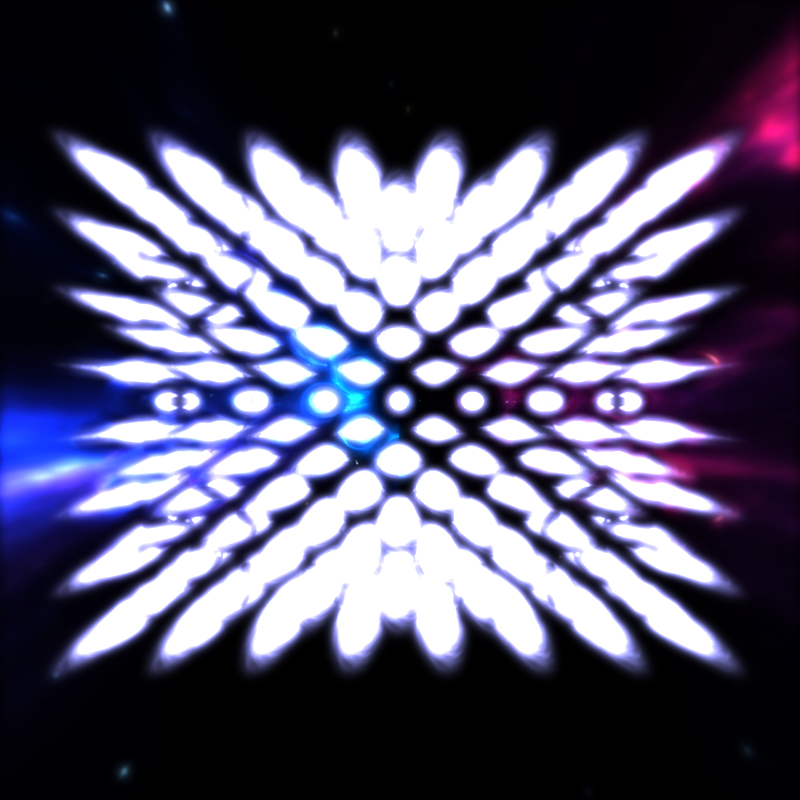

### Material Sorting
Although in some cases, sorting the segments based on terial would help reduce warp divergence and speed up render times, I found that my scenes never had enough materials to make this worth while. In fact, across all my scenes, there was a consistent drop in performance when I did sort the paths. My focus for this path tracer wasn't a vast amount of nice PBR materials with many different effects so although I implemented it as a future optimization for when I do increase the number of material types, for now, I found its more harmful than helpful. 

--- 

# Conclusion
Overall I was very happy with how this project turned out. The light bending and black holes, in my opinion, look really nice and render pretty quickly. As for some of the other implemented features, there is always room for improvement. First off, some things are kind of buggy and there are a few messy parts of the code I want to go back and clean up. Additionally I would like to add support for more types of materials including Transmisive materials, Sub Surface Scattering, and maybe volumes. Some better UI and parameters would also be really helpful for loading models, scenes, and environment maps. As a final send off, here are some more random renders I took through out the process of working on this project.

  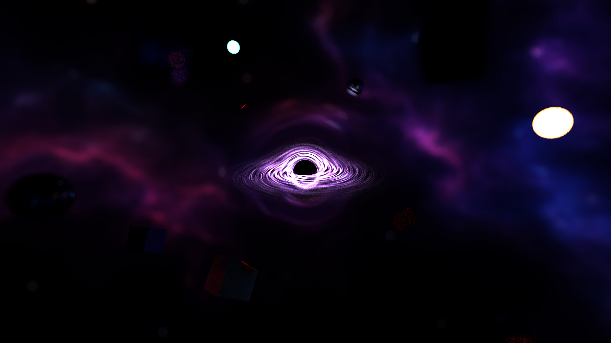
  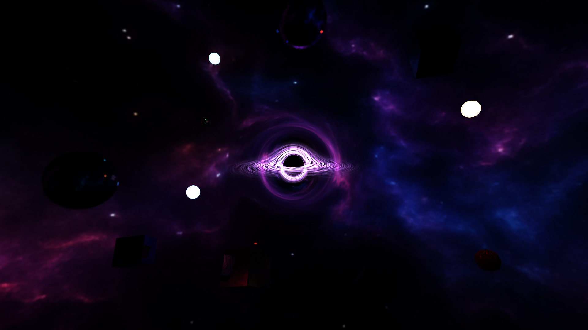

  
  

  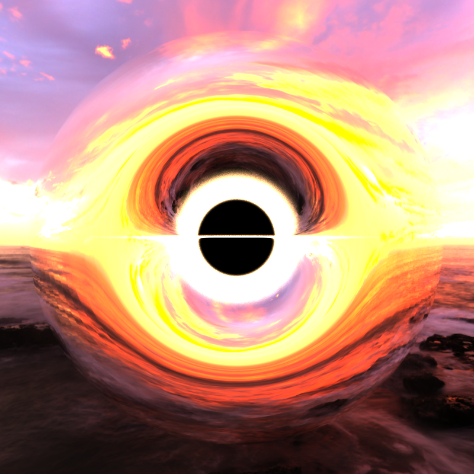
  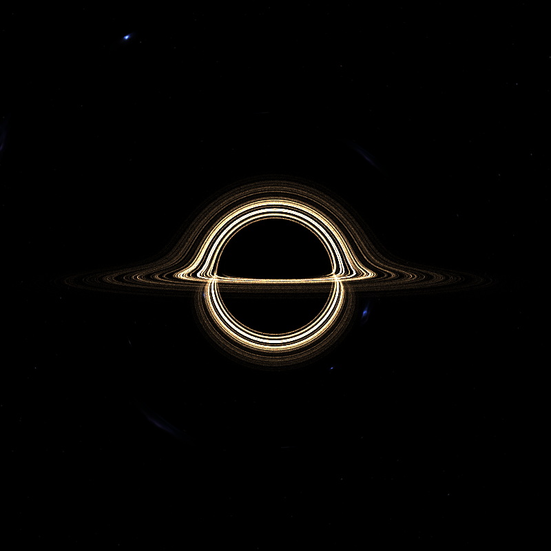

  

  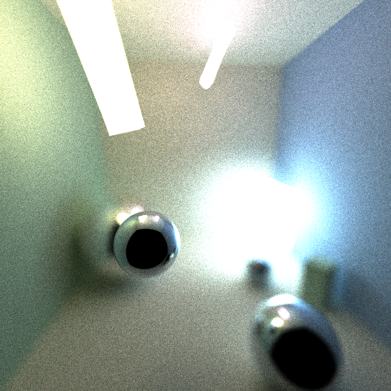

### Bloopers
These are just some wild renderes I got while trying to implement some of these features.

  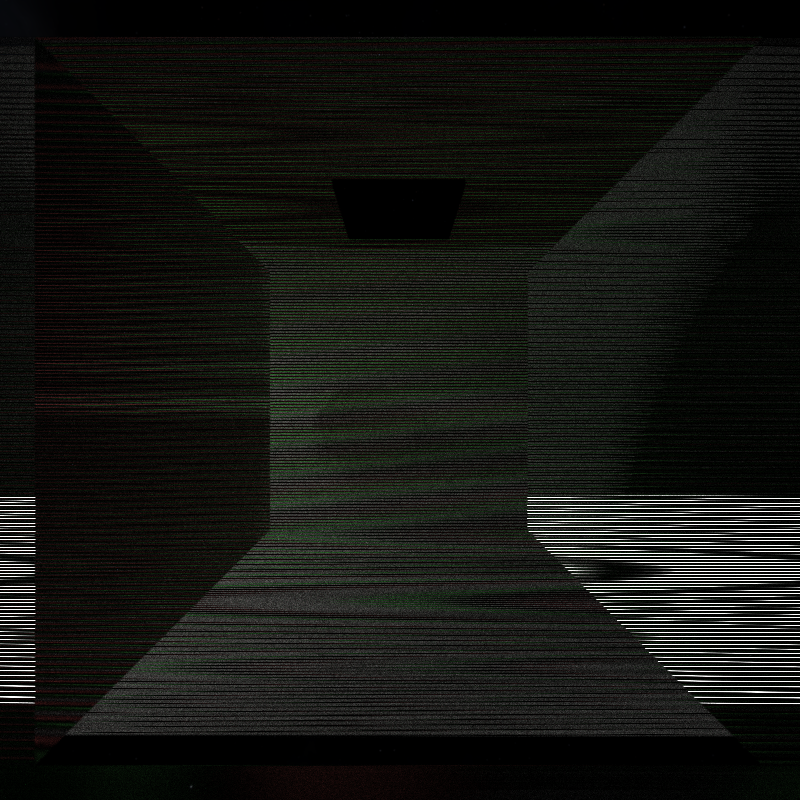

  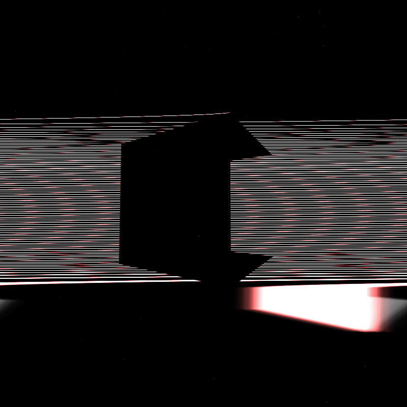

  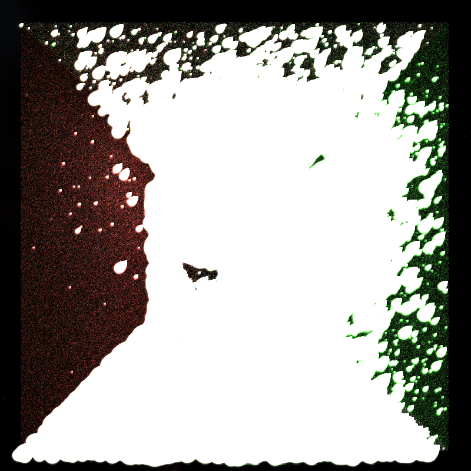

  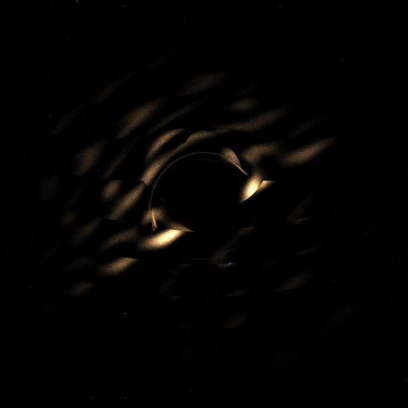

# References
- https://henrikdahlberg.github.io/2016/08/23/stream-compaction.html
- https://nvidia.github.io/cccl/thrust/api/group__stream__compaction_1gaf01d45b30fecba794afae065d625f94f.html
- https://jacco.ompf2.com/2022/04/13/how-to-build-a-bvh-part-1-basics/
- http://spiro.fisica.unipd.it/~antonell/schwarzschild/
- https://rantonels.github.io/starless/
- https://web.mit.edu/10.001/Web/Course_Notes/Differential_Equations_Notes/node5.html
- https://blog.seanholloway.com/2022/03/13/visualizing-black-holes-with-general-relativistic-ray-tracing/
- https://learnopengl.com/Advanced-Lighting/Bloom
- https://github.com/tinyobjloader/tinyobjloader/tree/release
- https://free3d.com/3d-model/hand-v3--902450.html
- https://www.spacespheremaps.com/hdr-spheremaps/
- https://pbr-book.org/3ed-2018/Camera_Models/Realistic_Cameras